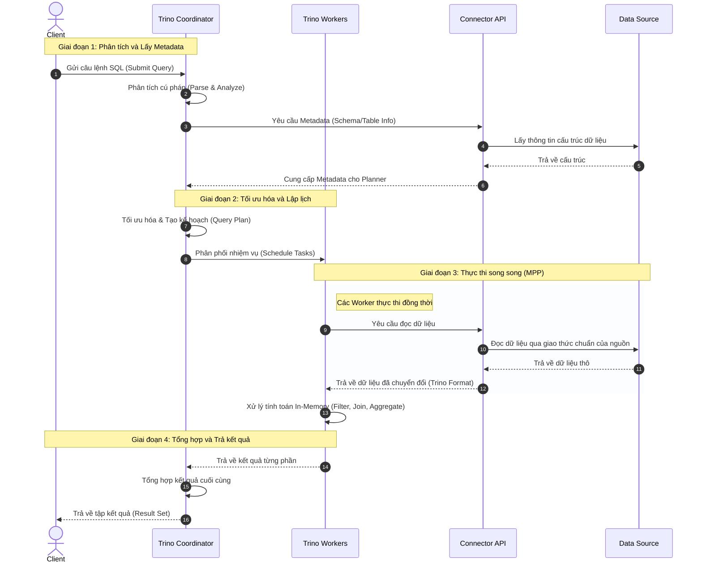

```mermaid
sequenceDiagram
    autonumber
    actor Client as Client
    participant Coordinator as Trino Coordinator
    participant Worker as Trino Workers
    participant Connector as Connector API
    participant DataSource as Data Source

    Note over Client, Coordinator: Giai đoạn 1: Phân tích và Lấy Metadata
    Client->>Coordinator: Gửi câu lệnh SQL (Submit Query)
    Coordinator->>Coordinator: Phân tích cú pháp (Parse & Analyze)
    Coordinator->>Connector: Yêu cầu Metadata (Schema/Table Info)
    Connector->>DataSource: Lấy thông tin cấu trúc dữ liệu
    DataSource-->>Connector: Trả về cấu trúc
    Connector-->>Coordinator: Cung cấp Metadata cho Planner

    Note over Coordinator, Worker: Giai đoạn 2: Tối ưu hóa và Lập lịch
    Coordinator->>Coordinator: Tối ưu hóa & Tạo kế hoạch (Query Plan)
    Coordinator->>Worker: Phân phối nhiệm vụ (Schedule Tasks)

    Note over Worker, DataSource: Giai đoạn 3: Thực thi song song (MPP)
    rect rgb(240, 248, 255, 0.25)
        Note right of Worker: Các Worker thực thi đồng thời
        Worker->>Connector: Yêu cầu đọc dữ liệu
        Connector->>DataSource: Đọc dữ liệu qua giao thức chuẩn của nguồn
        DataSource-->>Connector: Trả về dữ liệu thô
        Connector-->>Worker: Trả về dữ liệu đã chuyển đổi (Trino Format)
    end

    Worker->>Worker: Xử lý tính toán In-Memory (Filter, Join, Aggregate)

    Note over Worker, Client: Giai đoạn 4: Tổng hợp và Trả kết quả
    Worker-->>Coordinator: Trả về kết quả từng phần
    Coordinator->>Coordinator: Tổng hợp kết quả cuối cùng
    Coordinator-->>Client: Trả về tập kết quả (Result Set)
```
